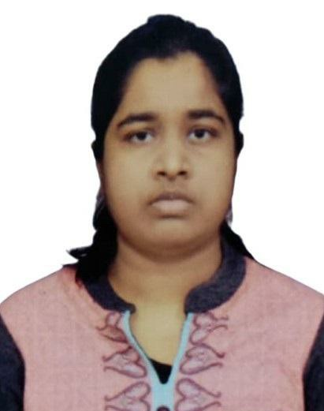

  

<main>

## DR. RIMJHIM SINHA (MBBS, M.D. Community Medicine)

📞 +91 70805 74534

✉️  rimjhim.sinha1995@gmail.com

📅 Date of Birth: 22-June-1995

Community Medicine postgraduate skilled in public health planning, epidemiology, and health education initiatives.

## Certifications

**1. CME on World AIDS Day, HIV/AIDS**

The Forgotten Epidemic

Year: 2023

**2. BCBR Qualified**

Year: 2023

**3. APRICON**

Apricon 23rd National Conference. Workshop on Manuscript Writing.

Year: 2023

**4. Epidemiology Foundation of India (EFICON)**

Poster Presentation on "Use of Artifical Intelligence (A.I.) as Evidence Based Medicine"

Year: 2024

**5. Hind Institute of Medical Sciences**

Presentation on "Anatomy of Basal Ganglia & Limbic Lobe - An Activity Based Integrated Approach"

Year: 2024

**6. PREVENCON**

Presentation on "The Role of Nutrition in Lifestyle Medicine: A Foundation for Health"

Year: 2025

## Education

**1. M.B.B.S.**

Hind Institute of Medical Sciences, Barabanki

Batch: 2014-15

Percentage: 67%

**2. M.D. Community Medicine**

Hind Institute of Medical Sciences, Barabanki

Batch: 2022-23

</main>
